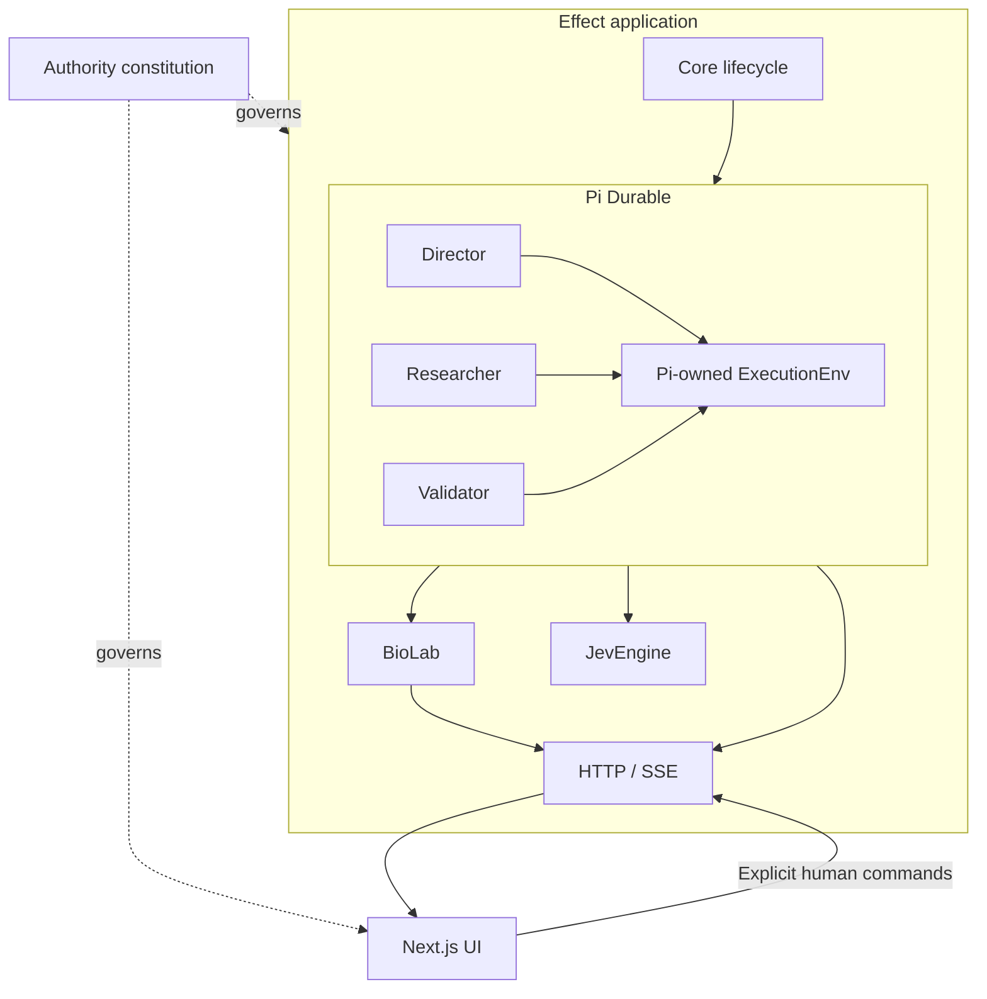

# Architecture and module design

The authority constitution governs one Effect application containing Core
lifecycle, BioLab, JevEngine, Pi Durable integration, and HTTP/SSE. Pi Durable
runs Director, Researcher, and Validator and alone owns ExecutionEnv. Next.js
observes the application and submits explicit human commands.

This shows ownership and interfaces, not a mandatory scientific procedure.
The [workflows](../workflows/README.md) define legal role sequencing.

## Interfaces and seams

| Module | Interface callers learn | Implementation it keeps local |
| --- | --- | --- |
| Core | Canonical lifecycle state in; next legal action out | Priority, recovery gates, validation and review gates |
| Roles within Pi Durable | Mission/objective/window in; decision/dossier/report out | Strategic cognition, local methods, independent critique |
| BioLab | Authorized domain intent and stable record references | Transactions, provenance checks, immutable history, retrieval |
| Jev | Question, subjects, projection in; semantic measurement out | Rendering, transport, batching, response validation |
| Pi integration | Role configuration, submitted input, settled output, abort/idle obligations | Conversations, durable tasks, compaction, resume, runtime accounting, sole ExecutionEnv ownership |
| Observation | Human commands and live/durable projections | Runtime projection, streaming, read models |

An interface includes ordering, authorization, failure modes, and cleanup, not
only parameter types. Domain handoffs use institutional references; Pi types
remain local to its integration seam.

The [installed Pi integration](PI_COMPATIBILITY.md#installed-integration) now
provides scoped storage/Harness acquisition and deterministic model/tool,
cancellation, and reopen qualification. BioLab mission storage and startup
ownership are implemented. Pi-owned Linux computation, artifact retention, and
cleanup are qualified at the integration seam. Role programs, handoffs, validation,
commands and conservative recovery now run through real stores in deterministic
integration tests. Semantic/capability tools and a committed activity projection are implemented.
Production composition, capability reuse and local UI observation have previous
qualification evidence; changed concurrency and discovery paths are tracked in
the implementation plan. Resource availability never authorizes scheduling.

## Depth and testability

Keep complex mechanics behind small interfaces. BioLab should absorb recording
checks instead of making every tool reconstruct them. Jev should absorb rendering
and result validation instead of making agents understand provider mechanics.
Core returns a decision; it never embeds research reasoning.

Accept dependencies in programs and test through the same interfaces callers use.
Internal seams can isolate mechanics without expanding the caller's interface.
Add an Adapter only where behavior actually varies; a single pass-through
implementation does not justify another runtime abstraction.

The deletion test explains the chosen structure: deleting the custom runtime
facade removes complexity, while deleting BioLab would scatter canonical
recording responsibilities across callers. Pi therefore keeps its own runtime;
BioLab keeps institutional ownership. These are design targets; the existing
contracts are not evidence of completed deep implementations.

[Constitution and authority](CONSTITUTION.md), and
[workflows](../workflows/README.md) define the behavioral obligations.

## Genesis integration

Genesis is the existing Director’s open-ended initialization turn coordinated
by Core. Director discovers, updates BioLab, uses Jev and chooses the inaugural
objective. It introduces no application peer or new role. During each Researcher
block, Director side work uses a separate environment without replacing the
active objective or bypassing validation.

[Genesis](GENESIS.md) owns initialization lifecycle, provenance, partial-failure
policy, and the distinction from later Refresh.
