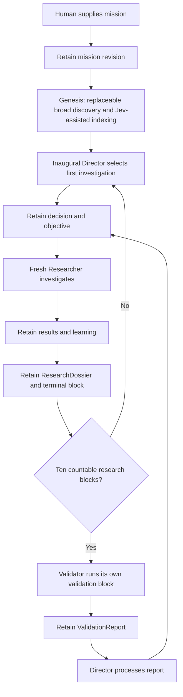

# Institutional and scientific workflows

These workflows specify required behavior. The [root README](../../README.md)
distinguishes current implementation from the plan. [Module design](../architecture/README.md)
defines interfaces; [authority](../architecture/CONSTITUTION.md#authority-and-recording-permissions) defines permissions.

## Canonical institutional cycle



This repeats until explicit human stop. Pause suspends further work; resume
continues the mission. Neither low novelty nor a model's opinion that the mission
is complete creates autonomous mission termination. Scientific methods remain
open within each investigation.

## Imported Pi runtime

The platform integration imports npm packages, not source from repos/pi. Use
Pi Durable's Harness, conversation, submission, and tool-task APIs for cognition.
Effect owns application resource lifetime and legal-action coordination; Pi owns
the runtime implementation. No application loop recreates Pi's generation or
conversation machinery.

All runtime cognition uses Durable with Pi AI models and Chord cancellation.
CodingTools are imported from Durable and use Pi-owned ExecutionEnv. Ordinary
programs and parallel computation run through those tools; no extra script VM
or second cognitive runtime is needed. Authorized recording tools call BioLab's
domain operations, preserving role permissions and attributable provenance.

## Startup and shutdown

1. Load configuration and acquire the single scheduler ownership lock.
2. Open institutional storage, cognition resources, and semantic measurement resources.
3. Start human command and observation interfaces.
4. Reconcile unfinished canonical work with runtime state before scheduling new work.
5. Enter the mission loop only when ownership and reconciliation succeed.

Completion means one scheduler owns the mission and all required resources are
available. Acquisition failures release already acquired resources and do not
invent research state. Shutdown stops new scheduling, requests Pi settlement/abort, awaits Pi-owned
ExecutionEnv cleanup, and releases application resources and the lock. Record actual
outcomes rather than implying interruption completed an investigation.

The backend now acquires exclusive store ownership, institutional mission
storage, and scoped Harness resources before serving status. Tests qualify
mission revision persistence and deterministic Pi model/tool/cancellation paths.
Role programs and command-driven continuous scheduling are qualified through
real Pi/BioLab integration tests. Startup reconciliation aborts interrupted work
without replay and retains its original block as failed/timed-out (or cancelled
when paused/stopped), preserving available canonical history. Production HTTP
commands and observation are wired to these programs. Real-process checks cover
model-turn SIGKILL, interrupted Researcher recovery with unchanged results,
missing runtime storage, and active SIGTERM settlement before BioLab release.
The implementation plan records the completed local v0 acceptance audit and
separates deterministic trajectory qualification from configured-provider checks.
Pi storage requires a single-process owner; acquire ownership before opening it.
Harness close preserves pending runtime work. Apply explicit run abort/cleanup
when stopping or orphaning work rather than treating resource close as completion.

## Mission scheduling

```text
read canonical lifecycle state
  -> nextAction(state)
  -> run exactly one legal action
  -> retain its actual outcome
  -> reread canonical state
```

The current policy has this priority:

| Condition | Action |
| --- | --- |
| Human stopped mission | STOP |
| Human paused mission | WAIT |
| Unfinished work needs reconciliation | RECOVER |
| Genesis is incomplete | RUN_GENESIS |
| Ten-block validation is due | RUN_VALIDATOR |
| Validation report awaits Director review | RUN_DIRECTOR |
| A strategic decision is required | RUN_DIRECTOR |
| An objective is ready | RUN_RESEARCHER |
| Otherwise | WAIT |

STOP and WAIT never authorize new cognitive work. Cleanup of already owned work
is a separate lifecycle obligation. The scheduler must not overlap independent
logical investigations or bypass validation. The pure nextAction policy receives lifecycle facts; it never calls Jev or
chooses datasets, hypotheses, methods, or representations. Its supplied Genesis
program can call Jev for required discovery measurements without choosing
scientific strategy.

## Initial discovery and inaugural direction

[Genesis](../architecture/GENESIS.md) owns initialization states, replacement,
partial-failure sufficiency, provenance, and Refresh semantics. The scheduler
requests its supplied discovery program before the first Director handoff. The
existing Pi Director searches the persisted map and creates the first decision
and objective; only then can normal research begin. Genesis and Refresh are
excluded from the research count. Recovery precedes a new initialization attempt.

## Director handoff

```text
create attributed AgentRun
  -> open/configure mission Director conversation
  -> inspect mission, relevant institutional history, and pending review
  -> choose next bounded investigation
  -> retain DirectorDecision and ResearchObjective through BioLab
```

Director can retrieve more history and use isolated computation/Jev as useful.
Its output explains why the objective matters without prescribing Researcher's
procedure. Decision/objective persistence must not expose an orphan objective as
ready. A pending ValidationReport must be processed and referenced by the retained
decision before the scheduler releases the review gate. A failed Director run
leaves no fabricated objective or satisfied review.

## ResearchBlock

```text
retain ResearchBlock and attributed AgentRun
  -> create fresh Researcher conversation
  -> Pi supplies its isolated ExecutionEnv; application starts the deadline
  -> investigate autonomously
  -> record meaningful attributable learning as it occurs
  -> retain ResearchDossier when available
  -> await Pi-owned computation cleanup and retain actual terminal state through BioLab
```

Approximately ten minutes is the normal v0 wall-time limit. Terminal outcomes
are COMPLETED, COMPLETED_NO_RESULTS, FAILED, TIMED_OUT, and CANCELLED. Absence of
results is an explicit outcome, not a zero-valued finding. Retain available
failure/uncertainty information even if the model cannot produce a full dossier.
A failed investigation without a dossier is retained as an OrphanBlock; never
invent its synthesis to make the lifecycle look successful.

A new block has a new Researcher. Recovery of an unfinished block retains the
same block identity; resuming it does not create an additional countable block.
This recovery rule applies to unfinished work, not to blocks already orphaned
by an explicit pause or cancellation.

## Scientific procedure remains open

The interface is objective in, attributable records and dossier out. What lies
between is Researcher's choice. These are illustrations, not required stages:

```text
institutional search -> public data -> Python analysis -> notice confounding
  -> alternative R model -> optional Jev comparison -> further computation
```

```text
search methods -> clone tool -> compile Rust -> process sequences
  -> compare representations -> test alternatives
```

A third investigation may use no Jev or literature at all. Hypothesis count,
source order, modality choice, and interestingness are not hard-coded.

## Attributable result recording

```text
Pi tool requests actual operation
  -> Pi-owned ExecutionEnv performs it
  -> operation returns receipt/artifacts
  -> authorized BioLab recording operation checks actor, provenance, and shape
  -> retain immutable ScientificResult
  -> retain separate Interpretation / ResultAssessment when warranted
  -> reference retained records in ResearchDossier
```

A structured-source retrieval uses its source/request/version provenance in the
same recording path. Pi output, schema-valid JSON, a literature claim, or a Jev
score alone cannot establish that computation happened. Failures remain failures;
negative and contradictory obtained outputs remain available for later learning.

## Optional semantic judgment

```text
agent/source-local search produces candidates
  -> agent formulates semantic question
  -> Jev returns typed measurement
  -> agent inspects result and uncertainty
  -> agent chooses consequences
  -> important measurement is retained through BioLab
```

Candidates might be interpretations, prior failures, representations, or tool
capabilities. The agent may compare method fit before execution or measure
relevance before reading strongest and contradictory matches. No fixed threshold
turns a measurement into a research decision. Semantic confidence never becomes
biological/statistical confidence.

## Capability evolution

```text
scientific need -> ad hoc solution -> useful working method
  -> reusable value recognized -> retain CapabilityVersion
  -> future Researcher retrieves and uses it
  -> retain outcomes and limitations -> Director assesses defaults
```

Registration is not required for every action. Researcher chooses local use;
Director decides qualified institutional defaults and rollback. Validator can
critique quality without activating defaults. Version history and assessments
stay with BioLab; Pi executes capabilities inside its owned ExecutionEnv.

## Ten-block validation and review

1. Derive the exact window from canonical block identities and terminal outcomes.
2. Set the validation gate after ten countable blocks; no new ResearchBlock starts.
3. Retain ValidationCycle, its own ValidationBlock, and AgentRun; ask Pi to create fresh Validator with a separate clean ExecutionEnv.
4. Independently review/reproduce as useful and retain ValidationReport.
5. Require Director to process the report and retain a decision citing it.
6. Release the gate only after that decision authorizes the next objective.

Completed blocks, including COMPLETED_NO_RESULTS, count. Failed and timed-out
ResearchBlocks with retained dossiers count. Cancelled blocks never count.
Cancelled, paused, and failed-without-dossier investigations are retained as
OrphanBlocks outside the countable research window. Their obtained results,
artifacts, failures, and available context remain history and can inform agents.
A resumed unfinished non-orphan block counts once.

Validator receives its own ValidationBlock within the ValidationCycle; it is
not one of the ten ResearchBlocks and does not advance the research counter.
The sequence is ten countable ResearchBlocks, one Validator block, Director
review, then the next ten countable ResearchBlocks.

| Transition | validationDue | Director review pending | Research allowed |
| --- | --- | --- | --- |
| Tenth countable ResearchBlock retained | true | false | No |
| Validator block running or failed | true | false | No |
| ValidationReport retained successfully | false | true | No |
| Director decision processes and cites report | false | false | Next ten-block window begins |

The research gate remains closed across the change from validationDue to review
pending. Recording the report and changing lifecycle flags must be one coherent
canonical transition. The next window is established only after Director review.

A failed/interrupted Validator leaves validation pending. A failed Director
review leaves review pending. Neither failure authorizes block eleven. Validator
is required for v0 and cannot directly choose the next investigation.

## Timeout and cancellation

```text
deadline or interruption
  -> stop admitting new work for the run
  -> abort Pi-owned work with a non-expired cleanup context
  -> await terminal/idle runtime state
  -> await Pi termination and cleanup of its owned ExecutionEnv work
  -> retain actual block outcome and available handoff
```

Only after cleanup succeeds can deadline expiration become TIMED_OUT. Cancelling
a wait is not cancellation of durable work. If cleanup fails, retain operational
failure/recovery-required state; do not falsely finalize successful cleanup.
Human stop prevents further scheduling and triggers the same owned-work cleanup.
Pause stops new scheduling, saves the active investigation as an OrphanBlock,
and requests Pi settlement/abort and cleanup of its runtime and ExecutionEnv work.
Retain the available records, artifacts, context, and original deadline as
history. The old deadline is no longer active after orphaning; it is not frozen
for resumption. Resume continues the mission with new legal work; it does not
restart the orphan block or count it toward validation. A new ResearchBlock gets
a fresh Researcher and deadline. Pausing does not complete the mission.

## Recovery

```text
canonical unfinished work + Pi durable state
  -> reconcile identity and actual outcome
  -> resume unfinished logical work or settle known completed work
  -> retain/reconcile handoff without duplicate records or block counts
  -> reread lifecycle state
```

If Pi state is unavailable, preserve BioLab history and reconstruct fresh agent
context from it. Exact prior reasoning is not required. Do not repeat completed
external actions blindly or invent success; uncertain outcomes remain explicit.
Pi reconciles and cleans computation through its owned ExecutionEnv. Each module repairs its own
state through its interface; orchestration never inspects Pi internal tables.

Existing validation/review gates survive restart. Recovery may continue an
unfinished block under its original identity; only a new block requires a fresh
Researcher by definition.

The implemented v0 policy conservatively aborts interrupted Pi work and settles
the original block as FAILED or TIMED_OUT against its original deadline. A
retained dossier controls countability; otherwise the block is orphan history.
Paused/stopped work becomes CANCELLED. A retained validation report keeps its
review gate; a missing report keeps validation due. No external action is
replayed to infer success, including when the Pi store is missing. Exact runtime
continuation is optional; honest reconciliation is required.

## Human commands and observation

```text
explicit human command -> backend validates command -> canonical lifecycle change
  -> scheduler rereads state -> legal action or owned-work cleanup
```

Commands are start, pause, resume, revise mission, and stop. Revisions retain
history and invalidate an unused objective from the previous direction. Active
work is orphaned before a revised mission proceeds through Director. BioLab
binds run admission to the mission revision used for role context and rejects
stale Director handoffs; reopening a run does not refresh that attribution. Pause,
revision and stop acknowledge only after owned work cleanup. Browser refresh
or disconnection does not alter scheduling.

```text
Pi committed activity -> stable live projection -> stream -> UI
BioLab retained history -> durable queries -> UI
```

| View | Useful information |
| --- | --- |
| Mission | Mission/revision, lifecycle, objective, block count, next validation point, latest decision |
| Live | Active role/run, model status, tool calls, real commands/output, Jev calls, errors, elapsed time, usage/cost |
| Research | Dossiers, results, interpretations, hypotheses, failures, uncertainty, capabilities |
| Validation | Window, report, reproduction/method concerns, Director response |

Activity events can describe run/model/tool/Jev start/completion, canonical-record
creation, or failure. They remain noncanonical projections; a record-created
event points to retained truth rather than replacing it. Show no fabricated
percentages, activity, or hidden chain-of-thought.

Retain requested and actual routed model identity in live usage projections.
Label catalog-derived costs as estimates; absent billing information stays
unavailable. [Pi model routing](../architecture/PI_COMPATIBILITY.md#production-model-routing)
defines the provider behavior behind these projections.


## Orphan history

OrphanBlock is a retained lifecycle classification, not deleted or zero-valued
research. Preserve the investigation identity, objective, available attribution,
outputs, artifacts, failure/cancellation reason, and context. Do not require a
fabricated dossier. Orphans remain searchable institutional history but stay
outside the ten countable ResearchBlocks.

A pause or cancellation does not manufacture a ValidationReport or clear an
existing validation/review gate. Resume must still complete required validation
and Director review before another research window can begin.

## Handoff and review observation

After Researcher cleanup and block settlement, the next Director receives the
latest canonical dossier and typed reference. Validator receives the ten-block
trajectory with its dossier bodies. A retained ValidationReport goes to Director;
research remains blocked until its reviewed decision and next objective are
retained. This applies before both block 11 and block 21.

HTTP snapshots expose validationHistory separately from the current lifecycle
cycle. Reviewed cycles remain visible when the current validation counter resets.
The UI displays retained cycle states instead of waiting to catch a transient
review transition over SSE.
